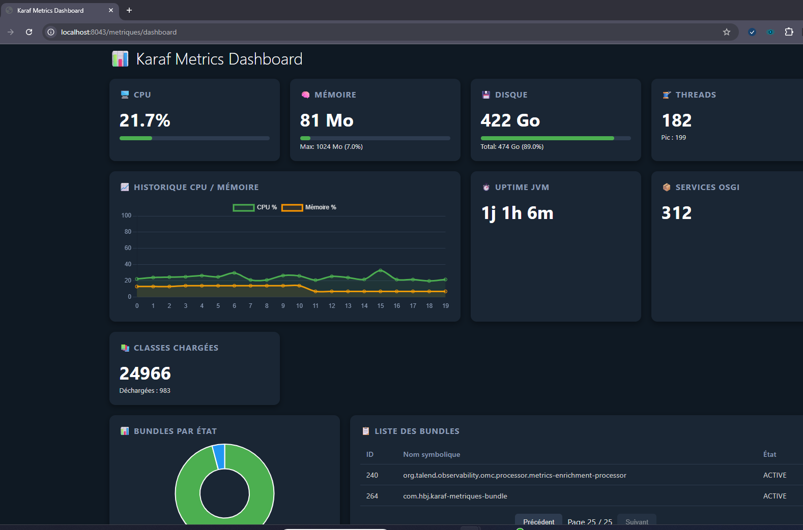

# Karaf Machine Dashboard
[](https://github.com/hatembenjaballah/karaf-metriques-bundle/releases)
Un tableau de bord de monitoring système en **temps réel** pour [Apache Karaf](https://karaf.apache.org/), utilisant **Server-Sent Events (SSE)** pour une remontée instantanée des métriques **CPU, mémoire, disque et réseau**.

- 🖥️** URL ** : http://[host]:[port]/metriques/dashboard 



## ✨ Fonctionnalités

- 📡 **Temps réel** – Les données sont poussées vers le navigateur toutes les 2 secondes via SSE.
- 🎨 **Design moderne** – Interface sombre avec effet « glassmorphism », cartes animées et barres de progression.
- 🧩 **Séparation front/back** – HTML, CSS et JavaScript dans des fichiers distincts, faciles à maintenir.
- 📊 **Métriques détaillées** – Pourcentage d’utilisation, valeurs absolues, tableau récapitulatif et liste des interfaces réseau.
- 🔌 **Zéro dépendance externe** – Fonctionne uniquement avec les features `http` et `http-whiteboard` de Karaf (pas de WebSocket ni de bibliothèques supplémentaires).
- 🔄 **Reconnexion automatique** – En cas de coupure réseau, le flux SSE se rétablit automatiquement.

## 📋 Prérequis

- **Apache Karaf** 4.3.x ou 4.4.x (testé avec 4.4.9)
- **Java** 8 ou supérieur
- **Maven** 3.6+

Les features suivantes doivent être activées dans Karaf :

```shell
feature:install http
feature:install http-whiteboard
